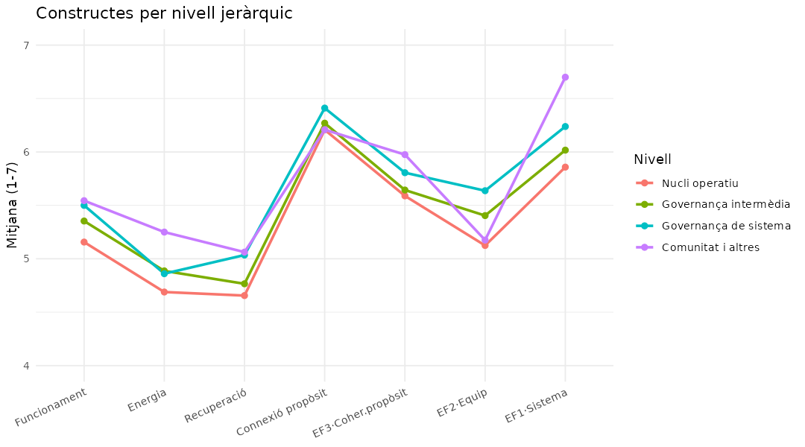
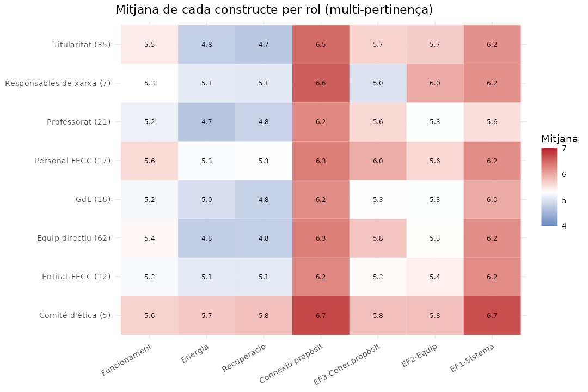

# Informe d'anàlisi — Enquesta d'avaluació de la coherència
### Fundació Escola Cristiana de Catalunya (FECC)

**Mostra:** 143 respostes (102 amb docència/intervenció directa) · **73 escoles** · escales Likert 1–7.
**Naturalesa:** estudi **exploratori** i **transversal** (observacional). Resultats de l'execució reproduïble de `analisi_enquesta.R`.

> **Nomenclatura (per evitar confusions):**
> - **Connexió de propòsit vital-personal** (*Connexió propòsit*) = BLOC 3, ítems 28, 29, 31 (ω=0,82). Alineació entre el propòsit personal i la feina.
> - **EF3 · Coherència de propòsit** (*EF3*) = factor empíric del Bloc 1 (ítems 1–5): percepció que la xarxa comparteix una mateixa raó de ser i prioritats.
> Són coses **diferents**: la primera és personal-laboral; la segona, institucional.
>
> Símbols: ✅ robust · ⚠️ cautela · ❌ hipòtesi no confirmada.

---

## 0. Marc metodològic

L'instrument mesura tres blocs de constructes:
- **BLOC 1 · Funcionament de la xarxa** (17 ítems): coherència de propòsit i prioritats, contextualització local, comunicació/mediació, feedback i aprenentatge, adaptació, lideratge distribuït, connexió multinivell, reflexió i confiança/eficàcia col·lectiva.
- **BLOC 2 · Sensació d'energia** (ít. 18–20) i **Recuperació energètica** (ít. 26–27).
- **BLOC 3 · Connexió de propòsit vital-personal** (ít. 28, 29, 31).

**Decisions preses** (justificades a les seccions 2, 3 i 11):
- Inversió dels ítems redactats en negatiu (6, 13, 19, 27), perquè "alt = millor" en tots.
- **Eliminació dels ítems 21 i 30** per incoherència amb la seva escala.
- **Fusió d'energia i recuperació** en les anàlisis empíriques (l'AFE demostra que no es diferencien).
- Tota l'anàlisi es fa **en paral·lel amb l'estructura teòrica i l'empírica** (AFE).

**Tècniques.** Fiabilitat amb **omega de McDonald** (preferible a l'alfa en escales curtes). Per la **no-normalitat** de les dades Likert (confirmada, § 10), les comparacions de subgrups es fan amb proves **no paramètriques** (Mann-Whitney per a 2 grups, Kruskal-Wallis per a 3+), amb **mides d'efecte** (r, ε², Cohen d) i **correcció per comparacions múltiples** (Holm/BH). Les relacions entre variables contínues, amb **Spearman** (IC 95% per bootstrap). La prova directa de P3, amb **regressió múltiple** (supòsits verificats i errors robustos) i **mediació**.

**Cautela transversal a tot l'informe:** amb n=143, molts subgrups petits i disseny observacional, els resultats són **exploratoris**; **no s'infereix causalitat** i molts efectes no superen la correcció global. Es prioritza la lectura de **mides d'efecte** i la **coherència** entre anàlisis.

---

## 1. Descriptius dels constructes

| Constructe | Mitjana (1–7) | DE | Mín–Màx |
|---|---|---|---|
| **Connexió de propòsit vital-personal** | **6,29** | 0,76 | 2,7–7,0 |
| **Funcionament de la xarxa** | **5,35** | 0,61 | 3,4–6,7 |
| Sensació d'energia | 4,84 | 0,75 | 2,7–6,7 |
| Recuperació | 4,83 | 1,20 | 1,5–7,0 |

**Lectura.** La **connexió de propòsit personal-laboral** és el punt més fort de tota l'enquesta (6,29/7): la gran majoria senten que la seva feina té sentit i s'alinea amb el seu propòsit vital. El **funcionament de la xarxa** és alt (5,35). En canvi, **energia i recuperació** són clarament més baixos (≈4,8) i, sobretot la recuperació, molt **dispersos** (DE=1,20; van d'1,5 a 7): hi ha molta desigualtat en com de recuperada se sent la gent. Aquest contrast —propòsit alt però energia baixa— és un dels fils centrals de l'informe.

---

## 2. Fiabilitat (consistència interna, omega de McDonald)

La fiabilitat indica si els ítems d'una escala mesuren de manera consistent el mateix constructe (llindar habitual: ≥0,70).

| Constructe | Ítems | ω | Valoració |
|---|---|---|---|
| Funcionament de la xarxa | 17 | **0,86** | Bona ✅ |
| **Connexió de propòsit vital-personal** | 3 | **0,82** | Bona ✅ |
| Recuperació | 2 | 0,63 | Feble ⚠️ |
| Sensació d'energia | 3 | 0,57 | Insuficient ⚠️ |

**Factors empírics del Bloc 1** (derivats de l'AFE, § 3): **EF3 · Coherència de propòsit** ω=0,85 · **EF1 · Comunicació/sistema** ω=0,83 · **EF2 · Coherència d'equip** ω=0,79. La versió empírica que fusiona energia+recuperació té ω=0,67.

**Lectura.** Els dos constructes centrals (funcionament i connexió de propòsit) són **fiables** i es poden interpretar amb garanties, igual que els tres factors empírics del Bloc 1. En canvi, el **bloc d'energia** és psicomètricament **feble**: l'escala de sensació d'energia (ω=0,57) està per sota del llindar acceptable, i la de recuperació (ω=0,63) hi frega. Això vol dir que **les conclusions sobre energia s'han de prendre amb cautela** i que aquest bloc és el primer candidat a millorar en una propera edició (§ 11). El fet que ω>α a la majoria d'escales indica que els ítems no pesen igual (no són tau-equivalents), cosa que justifica haver usat omega en comptes d'alfa.

---

## 3. Estructura factorial exploratòria (AFE del Bloc 1)

L'AFE examina **com co-varien els 17 ítems** per descobrir quantes dimensions de fons (factors) hi ha i quins ítems les componen. La matriu de partida és **policòrica** (adequada per a ítems ordinals).

**Adequació:** KMO=0,75 (bo) i test de Bartlett p<0,001 → la matriu és factoritzable. L'**anàlisi paral·lela** (comparació amb dades a l'atzar) indica **3 factors**, no les 8–9 dimensions teòriques previstes.

| Factor empíric | Ítems | Interpretació |
|---|---|---|
| **EF3 · Coherència de propòsit** | 1, 2, 3, 4, 5 | Compartir la raó de ser i les prioritats; contextualització |
| **EF2 · Coherència d'equip** | 9, 10, 11, 12, 15 | Feedback, adaptació i reflexió dins de l'equip propi |
| **EF1 · Comunicació/sistema** | 7, 8, 14, 16, 17 | Comunicació, connexió multinivell, aprenentatge i confiança en la xarxa |

**Lectura.** Les 8–9 dimensions teòriques fines **es col·lapsen en 3 grans factors**: allò de *propòsit compartit*, allò de *l'equip proper* i allò del *sistema/xarxa*. Aquesta és una troballa rellevant: empíricament, la coherència es viu en aquests tres plans, no en nou matisos separats. Els **ítems 6 i 13 queden fora** dels factors (baix ajust); es mantenen als constructes teòrics però no als índexs empírics (§ 11 explica per què i com millorar-los).

L'**AFE conjunta del Bloc 2+3** mostra, a més, que **energia i recuperació no es diferencien** empíricament (formen un sol factor), mentre que la **connexió de propòsit sí** que és un factor distint. Per això, en les anàlisis empíriques, energia i recuperació es tracten fusionades.

> ⚠️ L'AFE s'ha fet sobre la mateixa mostra que la resta d'anàlisis: l'estructura és **exploratòria** i caldria confirmar-la amb una anàlisi factorial **confirmatòria (CFA)** en una mostra independent.

---

## 4. Relació coherència–energia — **P3** (nucli de l'estudi)

### 4.1 Correlacions entre les tres dimensions (Spearman, IC 95% bootstrap)
| Relació | ρ | IC 95% |
|---|---|---|
| **Connexió propòsit ↔ Energia** | **0,43** | [0,29 – 0,56] |
| Funcionament ↔ Connexió propòsit | 0,38 | [0,22 – 0,51] |
| **Funcionament ↔ Energia** | **0,35** | [0,21 – 0,49] |

Totes tres són **positives, moderades i significatives** (l'IC exclou el 0).

**Quina faceta de coherència mou l'energia?** Descomponent el Bloc 1: **EF2 · Coherència d'equip (ρ=0,33)** i **EF1 · Comunicació/sistema (ρ=0,32)** es lliguen a l'energia més que no pas **EF3 · Coherència de propòsit (ρ=0,22)**. És a dir, l'energia depèn més d'allò **proper i quotidià** (equip, comunicació) que de la coherència de propòsit institucional abstracta. La **recuperació** és força **independent** de la coherència (ρ 0,05–0,16): recuperar-se sembla més una qüestió individual/contextual que no pas de coherència de xarxa.

### 4.2 Regressió múltiple (prova analítica directa de P3)
Model de l'energia amb predictors estandarditzats (R²=0,25 → expliquen ~25% de la variància de l'energia):

| Predictor | β estand. | p |
|---|---|---|
| **Connexió de propòsit** | **0,33** | <0,001 |
| **EF2 · Coherència d'equip** | **0,26** | 0,003 |
| EF1 · Comunicació/sistema | 0,03 | ns |
| EF3 · Coherència de propòsit | 0,01 | ns |

**Lectura.** Controlant-ho tot alhora, **només la connexió de propòsit i la coherència d'equip prediuen de manera única l'energia**. Les altres dues facetes de coherència (sistema i coherència de propòsit institucional) **no aporten pes propi**: el seu efecte bivariat quedava explicat per l'equip i el propòsit personal. La **recuperació** s'explica molt pitjor (R²=0,10; només hi contribueix la connexió de propòsit). Els **supòsits** del model (normalitat dels residus, homoscedasticitat, independència) es **compleixen**, i els errors robustos HC3 confirmen els resultats.

### 4.3 Direccionalitat (mediació)
Es van provar les dues direccions competidores (coherència→propòsit→energia i propòsit→coherència→energia). Els efectes indirectes són **significatius en tots dos sentits** (mediació **parcial**), amb la connexió de propòsit com a mediador lleugerament més fort (35% de mediació vs 21%).

> ⚠️ Amb dades transversals **la direcció causal no es pot establir** (els dos models "encaixen"). L'asimetria suggereix, com a hipòtesi, que la coherència podria alimentar l'energia **en part a través** del propòsit, però caldria un disseny longitudinal per confirmar-ho.

**Conclusió P3.** Coherència i energia estan **positivament relacionades** (moderat). El que més sosté l'energia és la **connexió de propòsit personal** i la **coherència de l'equip proper**, no la coherència abstracta del sistema. És un missatge accionable: per cuidar l'energia, cal treballar el sentit de la feina i la vida d'equip.

---

## 5. Diferències per subgrups — **P1 / P2**

> **Potència.** En una graella global de comparacions **cap efecte supera la correcció FDR** (n petita). Els resultats següents són **exploratoris**, basats en tests dirigits i mides d'efecte; es donen les **mitjanes concretes** per grup per facilitar-ne la lectura.

### 5.1 Nivell jeràrquic
Nivell derivat del càrrec (multi-rol → nivell més alt): Nucli operatiu (docents i equip directiu de centre) · Governança intermèdia (titularitats, GdE, tècnics FECC) · Governança de sistema (responsables i direcció general FECC) · Comunitat i altres (entitats FECC, comité d'ètica).

| Nivell (n) | Funcion. | Energia | Recup. | Connexió prop. | EF3 | EF2 | **EF1·Sistema** |
|---|---|---|---|---|---|---|---|
| Nucli operatiu (45) | 5,16 | 4,69 | 4,66 | 6,21 | 5,59 | 5,12 | **5,86** |
| Governança intermèdia (47) | 5,35 | 4,89 | 4,77 | 6,27 | 5,64 | 5,40 | **6,02** |
| Governança de sistema (43) | 5,50 | 4,86 | 5,03 | 6,41 | 5,81 | 5,64 | **6,24** |
| Comunitat i altres (8) | 5,54 | 5,25 | 5,06 | 6,21 | 5,98 | 5,18 | **6,70** |

**Lectura.** Hi ha un **gradient jeràrquic net en la percepció del sistema (EF1)**: com més amunt a la governança, més coherent es veu el sistema (de **5,86** al nucli operatiu fins a **6,70** a comunitat/central). És **l'única diferència que supera la correcció** (Kruskal-Wallis p_ajustada=0,030; ε²=0,08, efecte mitjà); el post-hoc situa la diferència entre el grup **"Comunitat i altres"** i el **nucli operatiu**. En canvi, energia, recuperació i connexió de propòsit són **força homogènies** entre nivells. **Interpretació:** els qui estan més a prop del centre de la Fundació perceben el sistema més coherent; el professorat i l'equip de centre, més fluix. És un possible **biaix de posició** a explorar a les entrevistes.

### 5.2 Rol (multi-pertinença)
Cada persona pot tenir diversos rols; es compara qui té cada rol (mitjanes 1–7):

| Rol (n) | Funcion. | Energia | Recup. | Connexió | EF3 | EF2 | EF1 |
|---|---|---|---|---|---|---|---|
| Equip directiu (62) | 5,36 | 4,77 | 4,79 | 6,32 | 5,76 | 5,32 | 6,20 |
| Titularitat (35) | 5,45 | 4,79 | 4,73 | **6,48** | 5,66 | **5,70** | 6,16 |
| Professorat (21) | 5,15 | 4,70 | 4,83 | 6,24 | 5,60 | 5,30 | **5,56** |
| GdE (18) | 5,22 | 4,96 | 4,81 | 6,20 | 5,32 | 5,28 | 5,97 |
| Personal FECC (17) | 5,59 | **5,25** | **5,29** | 6,31 | 5,95 | 5,61 | 6,20 |
| Comité d'ètica (5) | 5,65 | 5,73 | 5,80 | 6,73 | 5,80 | 5,80 | 6,68 |
| *Mostra* | 5,35 | 4,84 | 4,83 | 6,29 | 5,69 | 5,37 | 6,07 |

**Lectura.** El **professorat** és qui percep el **sistema més fluix** (EF1=5,56, el valor més baix de tots) — coherent amb el gradient jeràrquic. El **personal FECC** és qui reporta **més energia i recuperació** (5,25 i 5,29). La **titularitat** destaca en **coherència d'equip (EF2=5,70)** i **connexió de propòsit (6,48)**. El **comité d'ètica** puntua alt en gairebé tot (però només n=5 → cautela). El contrast **professorat vs personal FECC/direcció** és un dels fils més clars per a les entrevistes.

### 5.3 Etapa educativa (docents)
| Etapa (n) | Funcion. | Energia | Connexió | EF3 | EF2 | EF1 |
|---|---|---|---|---|---|---|
| Infantil (15) | 5,47 | 4,62 | 6,40 | 5,91 | 5,44 | 6,04 |
| Primària (43) | 5,47 | 4,70 | 6,38 | 5,97 | 5,36 | 6,14 |
| ESO (44) | 5,20 | 4,67 | 6,14 | **5,43** | 5,27 | 5,97 |
| Batxillerat (23) | 5,10 | 4,68 | 5,99 | 5,50 | 5,10 | 5,85 |
| FP (6) | 5,28 | **5,50** | 6,83 | 5,81 | 5,13 | 5,96 |

**Lectura.** Hi ha un patró d'**etapa**: **Infantil i Primària** són més positives (funcionament i EF3 més alts), mentre que **ESO i Batxillerat** són més **crítiques**, especialment en coherència de propòsit (EF3) i connexió de propòsit. La **FP** (n=6, cautela) destaca en energia. Suggereix que la coherència es percep més forta a les etapes inicials.

### 5.4 Context territorial i complexitat del centre
**Cap diferència significativa** en cap constructe. Ni el **servei territorial** ni el **tram de complexitat** del centre discriminen la coherència, l'energia o el propòsit. És una troballa en si mateixa: **el "on" (territori) i la mida/complexitat del centre no expliquen** aquestes vivències.

### 5.5 Xarxa d'escoles (només escoles, n=102: 66 en xarxa vs 36 independents)
Es considera "escola" qui fa docència/intervenció directa; "en xarxa" si el centre té una denominació de titularitat (congregació/fundació); "independent" si no.

| Constructe | En xarxa | Independent | p |
|---|---|---|---|
| **EF3 · Coherència de propòsit** | 5,56 | **5,98** | **0,036** |
| Connexió de propòsit | 6,20 | 6,44 | 0,066 |
| Recuperació | 4,52 | 4,97 | 0,063 |
| Energia | 4,67 | 4,87 | 0,192 |
| Funcionament | 5,25 | 5,41 | 0,162 |
| EF2 · Equip / EF1 · Sistema | ≈ igual | ≈ igual | ns |

**Lectura.** Les escoles **independents** tendeixen a puntuar **més alt** que les de xarxa en **coherència de propòsit (significatiu, p=0,036)** i, com a tendència, en connexió de propòsit i recuperació. Pot semblar contraintuïtiu (s'esperaria que la xarxa donés més coherència), i és una hipòtesi interessant: potser als centres independents la raó de ser és més compartida/propera. ⚠️ Efecte petit i grup "independent" reduït (36). *Nota:* sobre la mostra sencera (incloent-hi personal FECC central sense escola) l'efecte semblava més gran, però quedava **inflat** per barrejar-hi qui no és d'escola; en restringir a escoles reals, s'atenua.

---

## 6. Variables de control (ítems 23, 24, 25) i polivalència

Aquests ítems s'usen com a **paràmetres de control**: trajectòria de l'energia (23 des de l'inici del curs; 25 des que s'ocupa el rol) i antiguitat al rol (24).

**Relació amb els constructes (Spearman):**

| | Connexió propòsit | EF2 · Equip | EF3 · Coher. propòsit | Energia |
|---|---|---|---|---|
| **23 · tendència energia (curs)** | +0,23* | **+0,30*** | +0,13 | +0,40* |
| **25 · tendència energia (rol)** | +0,21* | **+0,27*** | −0,01 | +0,37* |
| **24 · anys al rol** | +0,05 | −0,03 | −0,15 | +0,07 |

**Lectura.** La **trajectòria d'energia percebuda** és el correlat més fort de l'energia actual (ρ≈0,37–0,40; explica ~25% de la seva variància): qui viu la seva energia com a **creixent o estable** puntua alt; qui la viu **decreixent o fluctuant**, baix. I —punt nou que demanaves— aquesta trajectòria es lliga sobretot a la **coherència d'equip (EF2, ρ≈0,27–0,30)** i a la **connexió de propòsit**, **no** a la coherència de propòsit institucional (EF3, ρ≈0). És a dir: sentir que l'energia va a millor va de la mà de tenir un **equip coherent** i un **propòsit personal connectat**, no tant de la coherència abstracta del sistema.

L'**antiguitat al rol (24)** **no** es relaciona de manera rellevant amb cap constructe (lleu tendència negativa amb EF3, −0,15). I el **nombre de rols** (polivalència) **no** s'associa a menys energia ❌: la hipòtesi que acumular càrrecs desgasta **no es confirma** (fins i tot lleugera tendència positiva); possiblement s'hi impliquen persones ja engrescades.

---

## 7. Projectes estratègics de la FECC

Els projectes estratègics (formacions, assessoraments, grups) es codifiquen com a participació: **EeX** (n=25), **EeXAMC** (n=30), **EdD** (n=7) i **GdE · Grups d'Experts** (n=18, que compta com a projecte a més de rol). La **hipòtesi** era que els participants mostrarien més coherència, energia i propòsit. Es prova la **direcció** de l'efecte (Cohen d amb signe: + = participants més alts) sobre tots els constructes.

### 7.1 Efecte de cada projecte (mitjana No / Sí · d · p)

**EeX (n=25) — l'únic amb efecte positiu en coherència:**
| Constructe | No | Sí | d | p |
|---|---|---|---|---|
| **EF3 · Coherència de propòsit** | 5,59 | **6,16** | **+0,64** | **0,003** |
| Connexió de propòsit | 6,24 | 6,53 | +0,39 | 0,110 |
| Funcionament | 5,31 | 5,50 | +0,31 | 0,156 |
| EF1 · Sistema | 6,04 | 6,23 | +0,27 | 0,390 |
| Energia | 4,87 | 4,69 | −0,23 | 0,380 |

→ Els participants d'EeX destaquen clarament en **coherència de propòsit** (efecte mitjà-gran, robust) i tendeixen a més connexió i funcionament, però **no** més energia.

**EeXAMC (n=30) — associat a MENYS energia:**
| Constructe | No | Sí | d | p |
|---|---|---|---|---|
| **Energia** | 4,89 | **4,62** | **−0,36** | **0,025** |
| EF1 · Sistema | 6,12 | 5,88 | −0,35 | 0,112 |
| Recuperació | 4,90 | 4,55 | −0,29 | 0,140 |
| EF3 | 5,73 | 5,54 | −0,21 | 0,314 |

→ Els d'EeXAMC reporten **menys energia** (significatiu) i tendència a menys sistema i recuperació; cap guany de coherència.

**EdD (n=7, molt poca potència):** tendència a menys energia (d=−0,51, ns) i menys connexió; res concloent.

**GdE com a projecte (n=18):** **sense guany de coherència**; fins i tot tendència a **menys EF3** (d=−0,47, p=0,072). Estar en un grup d'experts no s'associa a percebre més coherència.

**Participar en algun projecte (n=74):** **menys energia** (4,96→4,72; d=−0,32; **p=0,044**), sense canvis en coherència ni propòsit globalment. Hi ha, a més, un **gradient dosi-resposta**: com més projectes, menys energia.

### 7.2 A nivell d'escola
Les escoles que participen en projectes (44 de 68) tenen **més càrrega d'estrès** (mitjana 3,0 → 3,5 factors; p=0,018) i **menys energia** (p=0,044), amb tendència a **més coherència de propòsit** (EF3, p=0,079). Els factors d'estrès que més s'hi acumulen són de tipus **càrrega/desgast**: cansament físic (0%→42%), excés de càrrega (75%→100%), interrupcions (50%→83%) i falta de temps (75%→100%).

### 7.3 Interpretació
El patró és **consistent entre nivells** (persona i escola) i **matisat**:
- **EeX** és el projecte que "funciona" en clau de **coherència/propòsit** (probablement pel seu contingut i format).
- **La participació en projectes en general —i EeXAMC en particular— s'associa a menys energia i més càrrega d'estrès** (sobretot desgast físic i sobrecàrrega de temps).

> ⚠️ **Causalitat no establerta.** Dues explicacions són possibles i no excloents: (a) els projectes **afegeixen càrrega** i drenen energia; (b) **autoselecció** — s'hi impliquen persones ja més estirades o més crítiques. Distingir-les és una **pregunta clau per a les entrevistes**: cal entendre com dimensionar els projectes perquè aportin coherència (com EeX) **sense** drenar energia.

---

## 8. Nivell d'escola (ICC) — "compartir resultats"

Es va explorar si les persones d'una mateixa escola **s'assemblen** (component d'escola) amb l'**ICC** (proporció de variància entre escoles) sobre les 31 escoles amb ≥2 respostes.

| Constructe | ICC(1) | Lectura |
|---|---|---|
| Recuperació | 0,26 | Component d'escola apreciable |
| **Energia** | **0,25** | L'energia és, en part, un fenomen **de centre** |
| Funcionament | 0,16 | Component moderat |
| Connexió de propòsit | ~0 | **Purament individual** |

**Lectura.** L'**energia i la recuperació** tenen un **component d'escola** notable (ICC≈0,25): la gent d'un mateix centre s'assembla en el seu nivell d'energia → hi ha un "clima energètic" de centre. En canvi, la **connexió de propòsit és individual** (ICC≈0): no depèn de l'escola. Ara bé, ni xarxa, ni complexitat, ni territori **expliquen** aquest efecte d'escola en l'energia → prové de factors **no mesurats** (clima, estil de direcció, moment concret del centre). El consens intern (rwg) és alt en absolut però **inflat per l'efecte sostre** (gairebé tothom respon a la part alta).

> ⚠️ Amb 31 escoles petites, **no es fan models multinivell inferencials**; s'informa l'ICC com a **limitació** (les respostes d'una mateixa escola no són del tot independents, cosa que els tests individuals no modelen).

---

## 9. Perfils de participants (anàlisi de clústers)

Serveix per **enriquir la interpretació** (quins tipus de participant hi ha) i, sobretot, per **orientar la selecció d'entrevistes** amb base empírica.

> ⚠️ El *gap statistic* indica **estructura feble**: les dades són més un **gradient continu** que no pas grups nítids. Per tant, els perfils són una **base descriptiva per al mostreig intencional**, no una tipologia robusta. Es mostren **dues operacionalitzacions** i **dos nivells de detall** (k=3 i k=5).

### 9.1 Versió A · 3 macro-constructes (Funcionament, Energia/Recuperació, Connexió propòsit) — k=3
| Perfil | n | Funcionament | Energia/Recup | Connexió propòsit |
|---|---|---|---|---|
| Alt en tot | 64 | 5,84 | 5,09 | 6,73 |
| Baix en tot | 43 | 4,94 | 4,03 | 5,50 |
| Baixa coherència però amb energia | 36 | 4,95 | 5,33 | 6,44 |

### 9.2 Versió B · 5 dimensions (EF3, EF2, EF1, Energia/Recuperació, Connexió) — k=3
| Perfil | n | EF3 | EF2 | EF1 | Energia/Recup | Connexió |
|---|---|---|---|---|---|---|
| Alineats i amb energia | 79 | 6,13 | 5,77 | 6,44 | 5,15 | 6,75 |
| **Coherents però drenats** | 49 | 5,46 | 5,02 | 5,91 | **4,38** | 5,56 |
| **Poc coherents però amb energia/propòsit** | 15 | 4,19 | 4,44 | 4,67 | 4,66 | 6,27 |

### 9.3 Versió B · k=5 (afegeix el perfil de risc)
En passar a k=5 emergeix un perfil **"Tot baix" (n≈16)**: baixos alhora en coherència, energia i propòsit → **grup de risc**. Els altres es refinen (alineats / bé amb coherència mitjana / coherents drenats / poc coherents amb energia).

**Lectura.** Els perfils confirmen P3 (coherència, energia i propòsit tendeixen a moure's junts) però revelen **desacoblaments** molt informatius: **"coherents però drenats"** (veuen coherència i tenen propòsit, però estan sense energia; sovint direcció) i **"poc coherents però amb energia"**. Aquests casos "atípics" són els més reveladors per a entrevista. El perfil **"tot baix"** és petit (~11%) però prioritari (risc).

---

## 10. Constrenyiments (ítem 22): freqüències i co-ocurrències — **P2**

**Prevalença dels factors:** Excés de càrrega **66%** · Falta de temps **64%** · Interrupcions **59%** · Conflictes **35%** · Cansament físic **35%** · Reunions poc útils 21% · (la resta, <15%).

**Combinacions més freqüents (co-ocurrència):** *càrrega + temps* (48% de la mostra), *temps + interrupcions* (43%), *càrrega + interrupcions* (41%) → el **"triangle de la sobrecàrrega operativa"** és el bloqueig sistèmic **dominant**.

**Associacions més fortes (lift = més del que s'esperaria a l'atzar):** *cansament físic + situacions personals* (**1,76**), *conflictes + tasques no alineades* (**1,68**), *canvis/inestabilitat + interrupcions* (1,54), *falta de temps + manca de suport* (1,42). Són **síndromes secundaris** menys freqüents però amb associació forta: desgast personal-físic, conflicte-desalineació, inestabilitat.

**Distribució del nombre de factors per persona:** rang **1–9**, mitjana 3,5, moda 3, **asimètrica a la dreta** (no normal; Shapiro p<0,001). La majoria en marquen 2–4, amb una cua cap a molts constrenyiments.

**Els molt sobrecarregats (≥6 factors, n=14):** reporten **menys energia (4,0 vs 5,0), recuperació (4,0 vs 5,0) i connexió de propòsit (5,67 vs 6,33)**, i menys coherència d'equip; però **no** menys EF3/EF1. La relació és consistent: el nombre de factors correlaciona negativament amb energia (ρ=−0,38), recuperació (−0,41) i coherència d'equip (−0,32). Aquest grup **coincideix** amb el perfil "tot baix" dels clústers → **prioritari per a entrevista**.

**Lectura.** El principal **bloqueig sistèmic** és la **sobrecàrrega operativa** (càrrega/temps/interrupcions): molt prevalent i molt co-ocurrent. El que erosiona el benestar quan s'acumula no és qualsevol constrenyiment, sinó **la càrrega i el desgast**; i el que se n'endú és **l'energia, la recuperació i la connexió de propòsit** —no la percepció de coherència de sistema.

---

## 11. Recomanacions de mesura per a la propera enquesta

Diagnòstic de per què alguns ítems donen problemes i com millorar-los:

| Element | Per què falla | Com millorar-ho |
|---|---|---|
| **Ítem 6** (missatges contradictoris del sistema) | Redactat en negatiu i mesura soroll **extern** (Departament, inspecció, sindicats), diferent de "la FECC comunica bé"; no encaixa en cap factor | Reformular en positiu i cap al rol de la FECC ("la FECC m'ajuda a interpretar els missatges contradictoris"); o fer-ne una **dimensió pròpia amb ≥3 ítems** |
| **Ítem 13** (responsabilitats concentrades) | Negatiu; parla d'equip però empíricament es lliga al sistema amb signe contradictori (càrrega −0,60) | Reformular en positiu ("les responsabilitats i el lideratge estan ben repartits al meu equip") i afegir **2–3 ítems** de *lideratge distribuït* |
| **Ítems 21 i 30** (em drena l'energia / tasques que aporten poc) | Negatius; respostos de manera **inconsistent** (aquiescència/doble negació); es van haver d'eliminar | Evitar formulacions negatives aïllades; si se'n volen, posar-ne **diverses** i verificar-ne la direcció al pilotatge |
| **Bloc Energia** (ω=0,57) | Poques ítems que **barregen vigor i esgotament** en una escala curta | Usar una escala validada (p. ex. adaptar la subescala de *vigor* de l'UWES) amb **4–6 ítems** en direcció consistent; separar *vigor* i *esgotament* amb prou ítems cadascun |
| **Recuperació** (ω=0,63) | Només **2 ítems** | Ampliar a **3–4 ítems** |
| **Dimensions d'1 ítem** (D2, D6, D6.1, D7, D8) | Amb un sol ítem **no es pot mesurar la fiabilitat** ni fer-ne factor | Cada dimensió amb **≥3 ítems** |

**Regla general.** Els ítems que han donat problemes són **justament els redactats en negatiu** (6, 13, 21, 30). Per a la propera edició: (1) **minimitzar els ítems negatius**; (2) garantir **≥3 ítems per dimensió** en direcció coherent; (3) reforçar el **bloc d'energia** amb una escala validada més llarga. Amb això, l'energia i dimensions com el lideratge distribuït es podrien mesurar de manera fiable.

---

## 12. Síntesi per a les entrevistes (mostreig intencional)

La combinació d'anàlisis permet una **selecció traçable** de participants (perfils contrastats + casos extrems + mixtos):
1. **Perfil positiu** (alineats i amb energia) — cas de referència.
2. **Perfil "tot baix" / molt sobrecarregats (≥6 factors)** — casos crítics/risc.
3. **Coherents però drenats** (alta coherència, baixa energia) — sovint direcció; per entendre el desgast **malgrat** el propòsit.
4. **Poc coherents però amb energia** — què els sosté.
5. Contrast **professorat (EF1 baix) vs personal FECC/direcció** — el biaix de posició sobre el sistema.
6. **Projectes estratègics**: participants d'EeX (coherència) vs d'EeXAMC (menys energia) — valor vs càrrega.

*(Els identificadors dels casos —correus— són als fitxers de sortida, fora del repositori per privacitat.)*

---

## 13. Conclusions i limitacions

**Conclusions.**
1. Funcionament de la xarxa i connexió de propòsit són mesures **fiables**; el bloc d'energia és **feble** (cal reforçar-lo).
2. Empíricament, la coherència es resumeix en **3 factors** (EF3 propòsit / EF2 equip / EF1 sistema); energia i recuperació **no es diferencien**.
3. **Coherència i energia estan positivament relacionades** (P3); el motor principal és la **connexió de propòsit** i la **coherència d'equip**, no la coherència del sistema.
4. Hi ha un **gradient jeràrquic** en la percepció del sistema (EF1) i un contrast **professorat vs FECC/direcció**; **territori i complexitat no discriminen**; les escoles **independents** tendeixen a més coherència de propòsit.
5. La **participació en projectes** s'associa a **més estrès i menys energia** —**excepte EeX**, lligat a més coherència de propòsit.
6. El bloqueig dominant és la **sobrecàrrega operativa** (càrrega/temps/interrupcions); un grup petit acumula molts constrenyiments i està en risc.
7. L'energia té un **component d'escola** (ICC≈0,25) que les variables disponibles no expliquen.

**Limitacions.**
- Mostra modesta (n=143) i subgrups petits → **potència limitada** (cap efecte supera la correcció global).
- Disseny **transversal/observacional** → **no causal**.
- Estructura empírica i clústers derivats de la **mateixa mostra** → cal **validació externa** (CFA, mostra nova).
- **Fiabilitat baixa** del bloc d'energia → conclusions energètiques provisionals.
- Respostes niades en escoles (ICC≈0,25 energia) → lleugera **no-independència** no modelada.

---

*Detall numèric complet i sortides addicionals: fitxers `resultats_*.xlsx` i carpeta `sortides/` generats per `analisi_enquesta.R` (no inclosos al repositori: contenen dades identificatives).*
