# Informe d'anàlisi — Enquesta d'avaluació de la coherència
### Fundació Escola Cristiana de Catalunya (FECC)

**Mostra:** 143 respostes (102 amb docència/intervenció directa) · **73 escoles** · escales Likert 1–7.
**Naturalesa:** estudi **exploratori** i **transversal** (observacional). Es reporten mides d'efecte i correccions per comparacions múltiples. **No s'infereix causalitat.** Els resultats provenen de l'execució reproduïble de `analisi_enquesta.R`.

> **Com llegir aquest informe.** Cada secció indica la troballa, el gràfic o taula de suport i una **nota de cautela** quan cal. Els símbols: ✅ resultat robust · ⚠️ interpretar amb cautela · ❌ hipòtesi no confirmada.

---

## 0. Marc i decisions metodològiques

Tres blocs de constructes:
- **BLOC 1 · Funcionament de la xarxa** (17 ítems): coherència de propòsit, contextualització, comunicació/mediació, feedback, adaptació, lideratge, connexió multinivell, reflexió, confiança.
- **BLOC 2 · Sensació d'energia** (ít. 18–20) i **Recuperació** (ít. 26–27).
- **BLOC 3 · Alineament de propòsit vital–professió** (ít. 28, 29, 31).

Decisions preses (justificades més avall): inversió dels ítems negatius (6, 13, 19, 27); **eliminació dels ítems 21 i 30** per baixa coherència; **fusió d'energia i recuperació** en les anàlisis empíriques (l'AFE mostra que no es diferencien); tota l'anàlisi es fa **en paral·lel amb l'estructura teòrica i l'empírica**.

---

## 1. Descriptius dels constructes

| Constructe | Mitjana (1–7) | DE |
|---|---|---|
| **Alineament de propòsit** | **6,29** | 0,76 |
| **Funcionament de la xarxa** | **5,35** | 0,61 |
| Sensació d'energia | 4,84 | 0,75 |
| Recuperació | 4,83 | 1,20 |

L'alineament de propòsit personal–professional és el punt **més fort**; l'energia i la recuperació, els més baixos (i la recuperació, molt dispersa).

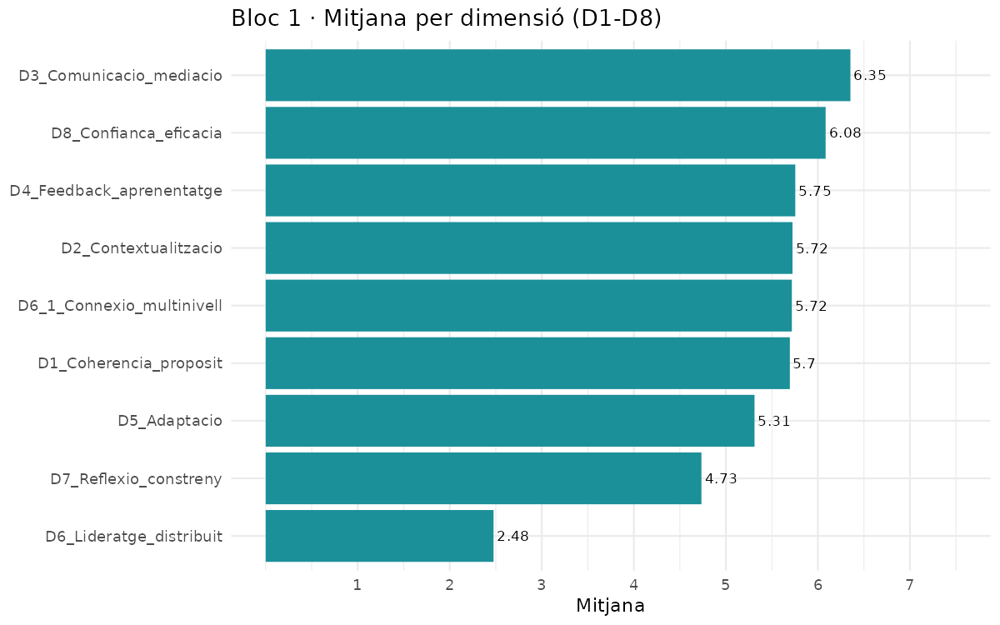

---

## 2. Fiabilitat (omega de McDonald)

| Constructe | Ítems | ω | Valoració |
|---|---|---|---|
| Funcionament de la xarxa | 17 | **0,86** | Bona ✅ |
| Alineament de propòsit | 3 | **0,82** | Bona ✅ |
| Recuperació | 2 | 0,63 | Feble ⚠️ |
| Sensació d'energia | 3 | 0,57 | Insuficient ⚠️ |

**Factors empírics** (derivats de l'AFE, § 3): EF3 *coherència de propòsit* ω=0,85 · EF1 *comunicació/sistema* ω=0,83 · EF2 *equip* ω=0,79 · Energia+Recuperació (fusionat) ω=0,67 · Propòsit ω=0,82.

> ⚠️ **Cautela:** el **bloc d'energia** és psicomètricament feble; les seves conclusions són provisionals. Els dos constructes centrals (funcionament i propòsit) sí que són fiables.

---

## 3. Estructura factorial (AFE)

**Bloc 1:** KMO=0,75, Bartlett p<0,001. L'anàlisi paral·lela indica **3 factors** (no les 8–9 dimensions teòriques):

| Factor empíric | Ítems | Interpretació |
|---|---|---|
| **EF3** | 1, 2, 3, 4, 5 | Coherència de propòsit i contextualització |
| **EF2** | 9, 10, 11, 12, 15 | Vida i funcionament de l'equip propi |
| **EF1** | 7, 8, 14, 16, 17 | Comunicació, connexió i confiança en el sistema |

- **Ítems exclosos dels factors** (mantinguts als constructes teòrics): **ít. 6** (càrrega <0,30) i **ít. 13** (càrrega −0,60, signe contradictori i contingut d'equip que empíricament no hi encaixa). Tots dos redactats en negatiu.
- **Bloc 2+3:** energia i recuperació **no es diferencien** empíricament (un sol factor); el **propòsit sí** que és un factor distint.

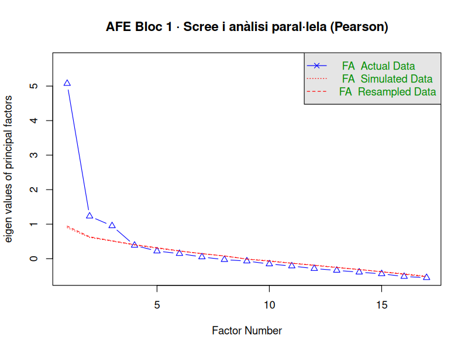

> ⚠️ L'AFE prové de la mateixa mostra que els contrastos → estructura **exploratòria**; caldria confirmar-la (CFA) en una mostra independent.

---

## 4. Relació coherència–energia — **P3**

### 4.1 Correlacions (Spearman, IC 95% bootstrap)
| Relació | ρ | IC 95% |
|---|---|---|
| **Propòsit ↔ Energia** | **0,43** | [0,29 – 0,56] |
| Funcionament ↔ Propòsit | 0,38 | [0,22 – 0,51] |
| **Funcionament ↔ Energia** | **0,35** | [0,21 – 0,49] |

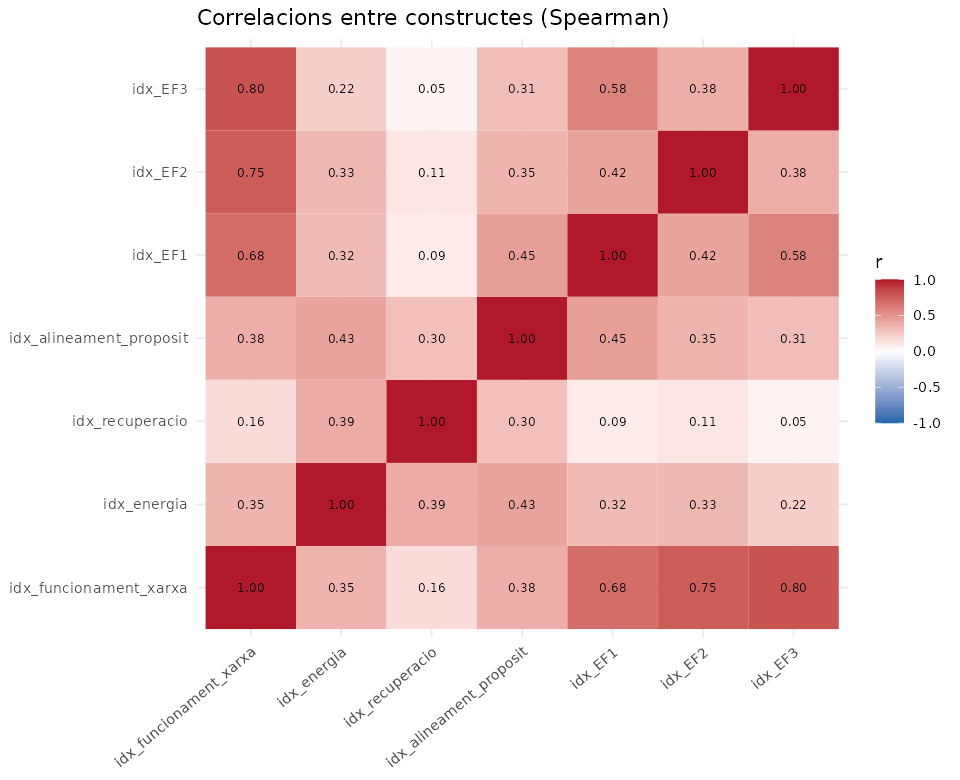

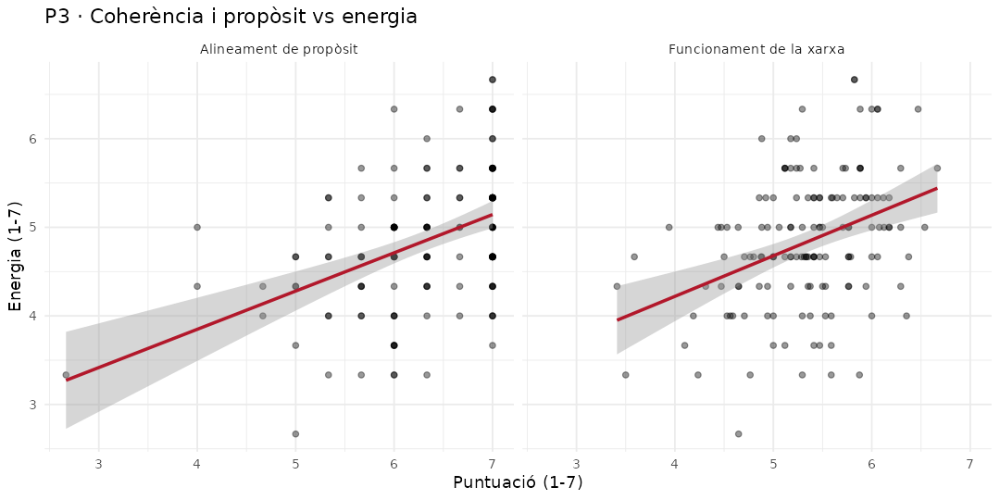

Quina **faceta** de coherència es lliga a l'energia: **equip (EF2) ρ=0,33** i **sistema (EF1) ρ=0,32** per sobre de la coherència de propòsit institucional (EF3 ρ=0,22). La **recuperació** és força independent de la coherència (ρ 0,05–0,16).

### 4.2 Regressió múltiple (prova directa de P3)
Model de l'energia (R²=0,25; betes estandarditzades):

| Predictor | β | p |
|---|---|---|
| **Alineament de propòsit** | **0,33** | <0,001 |
| **Coherència d'equip (EF2)** | **0,26** | 0,003 |
| Coherència sistema (EF1) | 0,03 | ns |
| Coherència propòsit (EF3) | 0,01 | ns |

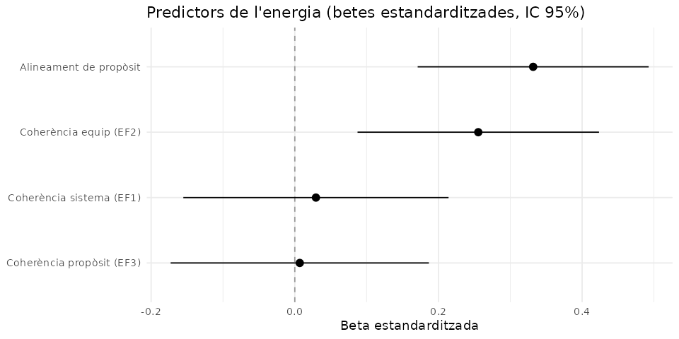

**Recuperació:** R²=0,10 (només el propòsit hi contribueix). **Supòsits** (normalitat, homoscedasticitat, independència) **verificats**; s'han reportat també errors robustos HC3.

### 4.3 Direccionalitat (mediació)
Els efectes indirectes són **significatius en tots dos sentits** (mediació parcial); el propòsit com a mediador és lleugerament més fort (35% vs 21% de mediació). 

> ⚠️ Amb dades transversals **la direcció causal no es pot establir**; caldria un disseny longitudinal.

**Conclusió P3:** coherència i energia estan **positivament relacionades** (moderat). El que més sosté l'energia és l'**alineament de propòsit** i la **coherència de l'equip proper**, no la coherència abstracta del sistema.

---

## 5. Diferències per subgrups — **P1 / P2**

**Nota de potència:** en una graella global de comparacions **cap efecte supera la correcció FDR**; els resultats següents són **exploratoris**, basats en tests dirigits i mides d'efecte.

- **Nivell jeràrquic:** l'única diferència que supera la correcció és en el factor **EF1 (comunicació/sistema)** (Kruskal-Wallis p_ajustada=0,030); el grup **"Comunitat i altres agents"** (entitats FECC, comité d'ètica) es diferencia del nucli operatiu.
- **Rol** (multi-pertinença): el **professorat** percep **menys coherència de sistema**; el **personal FECC**, **més energia**; la **titularitat**, més coherència d'equip.
- **Etapa** (docents): **Primària** més positiva en coherència; **ESO** més crítica en propòsit.
- **Context territorial i complexitat del centre:** **cap diferència significativa**.
- **Xarxa d'escoles** (només escoles, n=102): les escoles **en xarxa** puntuen lleugerament **més baix** en coherència de propòsit (p≈0,04); efecte petit.

> ✅ Fil per a les entrevistes: el **contrast professorat (escèptic) vs personal FECC/direcció (més positiu)** i el **gradient jeràrquic** en la percepció del sistema.

---

## 6. Variables de control (ítems 23-24-25) i polivalència

- **Trajectòria d'energia percebuda** (23, 25): fort correlat de l'energia actual (ρ≈0,37–0,40; explica ~25% de la variància). Qui viu la seva energia com a "creixent/estable" puntua alt; "decreixent/fluctuant", baix.
- **Antiguitat al rol** (24): **sense relació** rellevant amb cap constructe.
- **Nombre de rols** (polivalència): **no** s'associa a menys energia → la hipòtesi de sobrecàrrega per multi-rol **no es confirma** ❌.

---

## 7. Projectes estratègics de la FECC

Hipòtesi: els participants mostrarien més coherència, energia i propòsit. Resultat **parcial i, en energia, contrari**:

| Projecte | Efecte destacat |
|---|---|
| **EeX** | **+ coherència/propòsit** (factor empíric d=+0,58) ✅ |
| EeXAMC | **− energia** (d=−0,36) ❌ |
| EdD (n=7) | − energia (poca potència) |
| **Participar en general** | **− energia** (d=−0,47) i gradient dosi-resposta ❌ |
| GdE (com a projecte) | sense guany de coherència |

A **nivell d'escola**, les que participen tenen **més càrrega d'estrès** (p=0,018) i **menys energia** (p=0,044).

> ⚠️ Observacional: pot reflectir **desgast** dels projectes o **autoselecció** (s'hi impliquen persones ja estirades). Hipòtesi clau per a les entrevistes.

---

## 8. Nivell d'escola (ICC) i "compartir resultats"

- **Component d'escola** (ICC): **Energia 0,25 · Recuperació 0,26 · Funcionament 0,16 · Propòsit ~0**. L'energia és, en part, un fenomen **de centre**; el propòsit és **individual**.
- **Consens intra-escola** (rwg): alt en absolut (0,90–0,98), però **inflat per l'efecte sostre** (gairebé tothom respon 5–7) ⚠️.
- Ni xarxa, ni complexitat, ni territori **expliquen** l'energia de l'escola.

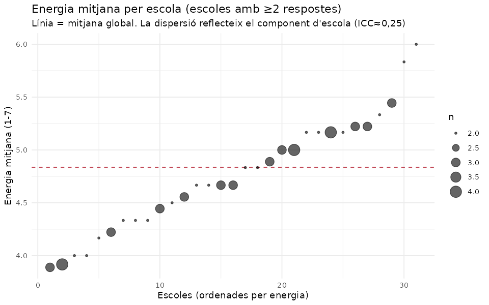

> ⚠️ Amb 31 escoles petites, **no es fan models multinivell inferencials**; s'informa l'ICC com a **limitació** (les respostes d'una mateixa escola no són del tot independents).

---

## 9. Perfils de participants (anàlisi de clústers)

> ⚠️ El *gap statistic* indica **estructura feble** (gradient, no tipus nítids). Els perfils són una **base descriptiva per al mostreig intencional** de les entrevistes, no una tipologia robusta.

Solució de referència (empírica, 5 dimensions, k=5):
- **Alineats i amb energia** · **Bé, coherència mitjana** · **Coherents però drenats** (desacoblament) · **Poc coherents però amb energia i propòsit** (desacoblament) · **"Tot baix"** (risc, n≈16).

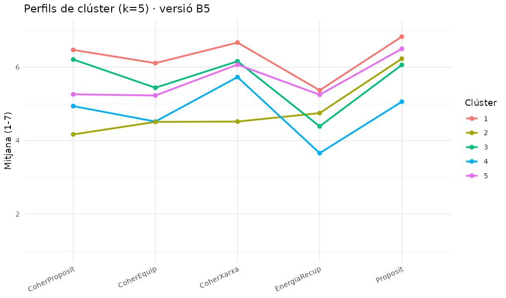

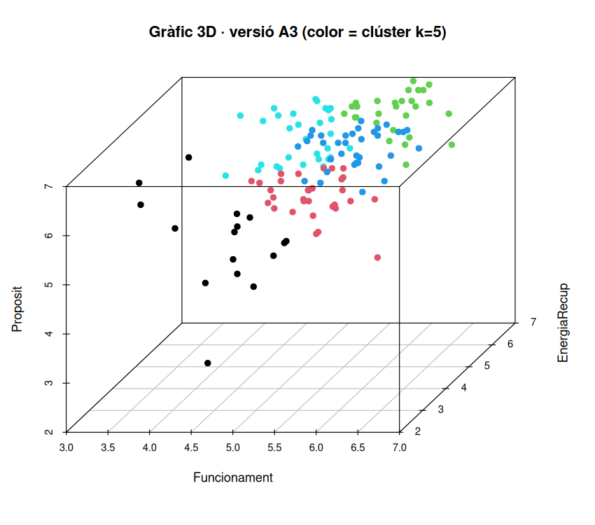

**Per a les entrevistes** (mostreig traçable): casos **representatius** de cada perfil + **casos extrems** (perfil "tot baix") + **casos mixtos** (alta coherència/baixa energia i viceversa). *(Els identificadors —correus— són a `sortides/`, fora del repositori per privacitat.)*

---

## 10. Constrenyiments (ítem 22): freqüències i co-ocurrències — **P2**

**Més prevalents:** Excés de càrrega **66%** · Falta de temps **64%** · Interrupcions **59%** · Conflictes 35% · Cansament físic 35%.

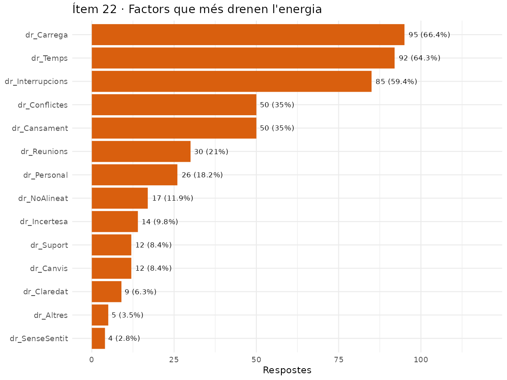

**Combinacions més freqüents:** *càrrega + temps* (48%), *temps + interrupcions* (43%) → el **"triangle de la sobrecàrrega"** és el bloqueig sistèmic dominant.

**Associacions més fortes (lift):** *cansament físic + situacions personals* (1,76), *conflictes + tasques no alineades* (1,68) → síndromes secundaris diferenciats.

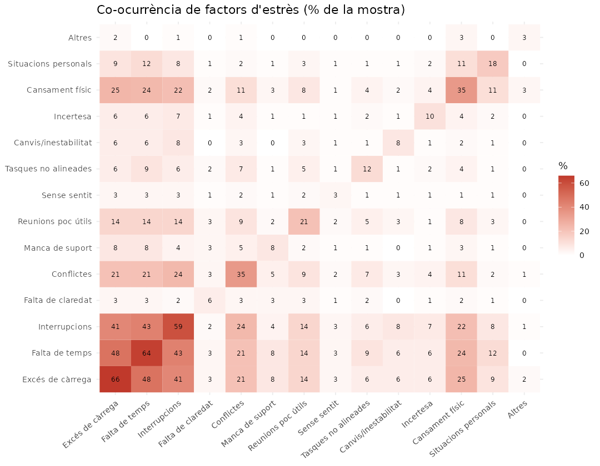

**Distribució del nombre de factors per persona:** rang **1–9**, mitjana 3,5, **asimètrica a la dreta** (no normal). Un grup petit (≥6 factors, n=14, ~10%) acumula molts constrenyiments.

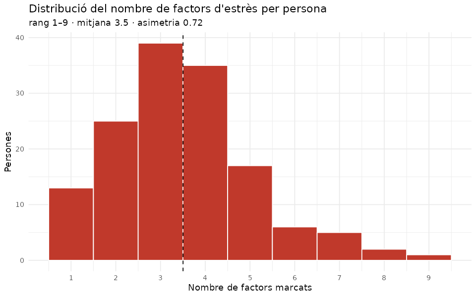

**Els molt sobrecarregats (≥6 factors)** reporten **menys energia, recuperació i propòsit** (i menys coherència d'equip), però **no** menys coherència de propòsit/sistema. Coincideixen amb el perfil "tot baix" → **prioritaris per a entrevista**.

---

## 11. Síntesi per a les entrevistes (mostreig intencional)

1. **Perfil positiu** (alineats amb energia) — cas de referència.
2. **Perfil "tot baix" / molt sobrecarregats** — casos crítics.
3. **Coherents però drenats** (alta coherència, baixa energia) — sovint direcció; entendre el desgast malgrat el propòsit.
4. **Poc coherents però amb energia** — què els sosté.
5. Contrast **professorat vs personal FECC/direcció**.
6. Aprofundir en **projectes estratègics** (valor vs càrrega) i en la **sobrecàrrega operativa** (càrrega/temps/interrupcions).

---

## 12. Conclusions i limitacions

**Conclusions.**
1. Funcionament de la xarxa i alineament de propòsit són mesures **fiables**; el bloc d'energia és **feble**.
2. Empíricament, la coherència del Bloc 1 es resumeix en **3 factors** (propòsit / equip / sistema); energia i recuperació **no es diferencien**.
3. **Coherència i energia estan positivament relacionades** (P3); el motor principal és l'**alineament de propòsit** i la **coherència d'equip**.
4. Les diferències més útils (P1/P2) són el **gradient jeràrquic** i el contrast **professorat vs FECC/direcció**; **territori i complexitat no discriminen**.
5. La **participació en projectes** s'associa a **més estrès i menys energia** (excepte EeX, lligat a més coherència).
6. El bloqueig sistèmic dominant és la **sobrecàrrega operativa**; hi ha un grup petit "tot baix" en risc.

**Limitacions.**
- Mostra modesta (n=143) i subgrups petits → **potència limitada** (cap efecte supera la correcció global).
- Disseny **transversal/observacional** → **no causal**.
- Estructura empírica i clústers derivats de la **mateixa mostra** → cal **validació externa** (CFA, mostra nova).
- **Fiabilitat baixa** del bloc d'energia → conclusions energètiques provisionals.
- Respostes niades en escoles (ICC≈0,25 en energia) → lleugera **no-independència** no modelada.

---

*Detall numèric complet i sortides addicionals: fitxers `resultats_*.xlsx` i carpeta `sortides/` generats per `analisi_enquesta.R` (no inclosos al repositori per contenir dades identificatives).*
